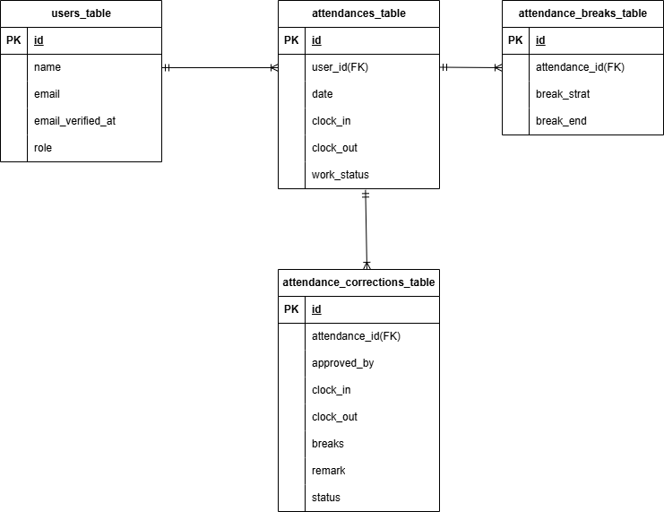

# ① git clone

github よりソースを取得する

```
git clone https://github.com/yo003002/time-and-management-system.git
```

階層を変更する

```
cd time-and-management-system
```

laravel のプロジェクト名に、フォルダ名を変換する
（例 laravel-template → laravel-basic 等）

# ② docker compose

`先ほど変更したフォルダ名がVSCodeのトップになっていることを必ず確認すること`  

docker をインストールしていない場合は、使用中の PC に合わせてインストール  
https://www.docker.com/get-started/

`docker compose up -d --build`

`docker compose exec php bash`

> **もし docker compose が動かない場合**
> docker-compose に読み替えて実行してみてください。


```
もし、  
Project directory "/var/www/." is not empty.   
というエラーが出たら、srcフォルダの中の .gitkeep は削除して、再度実行してください。  
```
 Your requirements could not be resolved to an installable set of packages.　で弾かれた場合、下記のコードでblock-insecure を無効にして、再度ダウンロードする
 
`composer config --global audit.block-insecure false`

## パッケージのインストール
```
composer install
```

# ③ laravel の環境を修正

#### `config/app.php` の timezone を修正

```
'timezone' => 'UTC',
↓
'timezone' => 'Asia/Tokyo',
```

#### `.env` の作成
```
cp .env.example .env
```

#### `.env` の修正

DB_HOST, DB_DATABASE, DB_USERNAME, DB_PASSWORD の値を変更

[](https://gyazo.com/2a9477db28b24ca194ac6e3d69aafd58)

#### mailhogの設定

MAIL_SCHEMEの削除　MAIL_ENCRYPTIONの追加　MAIL_MAILER・MAIL_HOST・MAIL_PORT　の値変更


#### npm の実行

package の変更があった場合、_src_ フォルダで `npm install` を実行する

```
cd src
npm install
npm run build
```
### keyの作成
```
php artisan key:generate
```
### DATABASEの作成
```
php artisan migrate
```
```
php artisan db:seed
```


# ④ laravel のテスト環境を作成

#### テスト用のデータベースを作成

[](https://gyazo.com/b10def21c9dfe7c0af503ac3671e9988)

#### .env.testing を編集
.env.testing ファイルの文頭部分にある APP_KEY を編集。

```
APP_NAME=Laravel
- APP_KEY=xxxxxxxxx
+ APP_KEY=
APP_DEBUG=true
APP_URL=http://localhost
```


先ほど「空」にした APP_KEY に新たなテスト用のアプリケーションキーを加えるために以下のコマンドを実行

```
php artisan key:generate --env=testing
```

また、キャッシュの削除をしないと反映されなかったりするので、下記コマンドもコマンドラインで実行

```
php artisan config:clear
```

マイグレーションコマンドを実行して、テスト用のテーブルを作成

```
php artisan migrate --env=testing
```

## 使用技術
- PHP 8.4.14
- Laravel Laravel Framework 12.47.0
- nginx/1.21.1
- mysql from 11.8.3-MariaDB

## ER図
- 

## URL
- 開発環境　http://localhost/